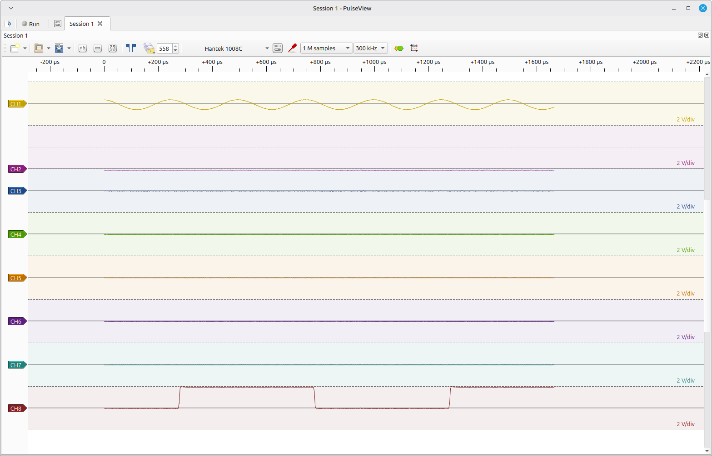
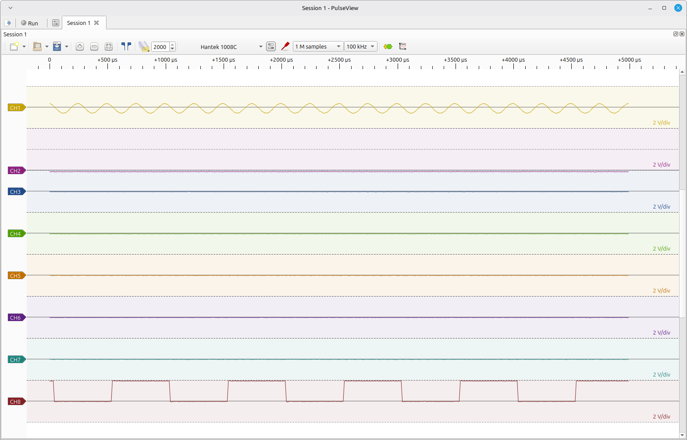

# Multi-channel samplerate protocol lab

This lab is intentionally broader than the first implementation change.  It is
designed to answer the channel-width, A0-versus-AA, sparse-mask, per-channel
samplerate, repeatability, and odd-partner-lane questions with as few code/test
iterations as practical.

The test program is `tools/probe_multichannel_samplerate.py`.  It retains raw
buffer 02/03 data, USB transaction logging, timing/ready-state metrics, and a
JSON report.  Known test frequencies are measurement references only; no
waveform-specific filtering, thresholding, flattening, smoothing, repair, or
reconstruction is applied.

## Suite `rate`

Runs contiguous CH1..CHN for N=1..8 using the acquisition widths observed in
the official Windows application: 1,2,4,4,6,6,8,8.  Two captures per plan are
made by default.  It measures physical frame size, per-lane word counts, CH1
period/sample rate, CH2 period/sample rate when present, hardware ready state,
and acquisition timings.

Run this at both validated Triggered A3 rates (11 and 0F).  This checks whether
the channel-width relationship is invariant across the two production-rate
families rather than assuming the 10 ms/div Windows observation generalises.

## Suite `semantics`

At each odd boundary N=3,5,7 the lab runs all four combinations:

- A0 logical count + AA logical mask
- A0 rounded width + AA logical mask
- A0 logical count + AA rounded-width mask
- A0 rounded width + AA rounded-width mask

This isolates which command controls physical acquisition geometry.  It also
runs sparse masks CH1+CH8, CH1+CH3, CH1+CH4, and CH1+CH6 to check whether active
physical channels are packed into the returned stream.

## Suite `partner`

This is run three times, with a distinctive 4 kHz signal moved to CH4, CH6,
and CH8 respectively while CH1 remains the 1 kHz trigger/reference.  For each
odd logical count it compares the exact logical mask against the official
Windows rounded-width mask.  The result tells us whether the extra lane carries
the adjacent physical ADC input or is padding/internal acquisition state.

## Evidence discipline

The official Windows width table remains an observation, not an architectural
claim.  Python results are protocol-lab evidence until hardware validation is
complete.  Only then should the canonical Python acquisition API and the
libsigrok production driver gain a multi-channel sampling model.

## 2026-08-30 and 2026-09-01 hardware-validated result

The A3=0x11 and A3=0x0F laboratory series are complete on the development unit.  The
Windows-observed width table is now independently reproduced by Linux direct
ADC captures and the routing semantics are hardware-validated.

For N enabled physical channels, the acquisition stream width is:

| Enabled channels | Physical width | A3=0x11 | A3=0x0F |
|---:|---:|---:|---:|
| 1 | 1 | ~800 kS/s/channel | ~2.4 MS/s/channel |
| 2 | 2 | ~400 kS/s/channel | ~1.2 MS/s/channel |
| 3 | 4 | ~200 kS/s/channel | ~600 kS/s/channel |
| 4 | 4 | ~200 kS/s/channel | ~600 kS/s/channel |
| 5 | 6 | ~133.3 kS/s/channel | ~400 kS/s/channel |
| 6 | 6 | ~133.3 kS/s/channel | ~400 kS/s/channel |
| 7 | 8 | ~100 kS/s/channel | ~300 kS/s/channel |
| 8 | 8 | ~100 kS/s/channel | ~300 kS/s/channel |

`AA` selects arbitrary physical inputs.  Enabled inputs are compacted into the
returned stream in ascending physical-channel order.  This was directly
verified with CH1 carrying the onboard 1 kHz square reference and CH8 carrying
an independent 4 kHz sine: `AA = CH1+CH8` produced a two-wide stream with CH1
in lane 1 and CH8 in lane 2, both measuring ~400 kS/s/channel.

For odd enabled counts greater than one, the final physical acquisition slot is
unused/dummy rather than an implicitly enabled adjacent channel.  This was
directly verified at every odd boundary by moving the independent 4 kHz source
to the candidate adjacent input:

- CH1..CH3 enabled: lane 4 remained quiet; explicitly enabling CH4 made the
  4 kHz signal appear in lane 4 at ~200 kS/s.
- CH1..CH5 enabled: lane 6 remained quiet; explicitly enabling CH6 made the
  4 kHz signal appear in lane 6 at ~133.3 kS/s.
- CH1..CH7 enabled: lane 8 remained quiet; explicitly enabling CH8 made the
  4 kHz signal appear in lane 8 at ~100 kS/s.

Changing `A0` between the logical enabled count and the rounded physical width
did not change the observed odd-width geometry.  Therefore the exact semantic
role of `A0` remains unresolved; production code must not infer more than the
evidence supports.  The canonical configuration uses the logical enabled count
for `A0` and the actual physical-channel mask for `AA`.

The 2026-09-01 A3=0x0F canonical-mask matrix reproduced the same physical-width
table and measured a ~2.4 Mword/s aggregate stream. For odd logical counts,
candidate widths 4/6/8 recovered the 4 kHz CH1 reference with correlations near
0.9996, while incorrect widths 3/5/7 produced materially poorer correlations.

## 2026-09-05 PulseView end-to-end validation

The native libsigrok driver was exercised through PulseView on the development
unit after independent A2=03 calibration was available for all eight physical
channels. CH1 carried a 4 kHz sine wave. A 1 kHz / nominal 2 Vp-p square wave
was moved successively through CH2 to CH8 as each channel-count boundary was
tested. Other visible inputs were grounded where probes were available or left
undriven; they did not acquire copies of either driven waveform.

Every contiguous enabled-channel count passed at both production Triggered
rates:

| Enabled channels | Physical width | A3=0x0F rate | A3=0x11 rate | Samples/channel | Result |
|---:|---:|---:|---:|---:|:---:|
| 1 | 1 | 2.4 MSa/s | 800 kSa/s | 4000 | PASS |
| 2 | 2 | 1.2 MSa/s | 400 kSa/s | 2000 | PASS |
| 3 | 4 | 600 kSa/s | 200 kSa/s | 1000 | PASS |
| 4 | 4 | 600 kSa/s | 200 kSa/s | 1000 | PASS |
| 5 | 6 | 400 kSa/s | 133.333 kSa/s | 666 | PASS |
| 6 | 6 | 400 kSa/s | 133.333 kSa/s | 666 | PASS |
| 7 | 8 | 300 kSa/s | 100 kSa/s | 500 | PASS |
| 8 | 8 | 300 kSa/s | 100 kSa/s | 500 | PASS |

The same PulseView validation was then extended across the complete Triggered
A3=0x0F and A3=0x11..0x19 family in one build. CH1 carried a 20 Hz sine and a
second enabled channel carried the onboard 1 kHz square. Every listed rate
passed at physical widths 2, 4, 6 and 8:

| Physical width | Validated samples/s/channel, slow to fast |
|---:|---|
| 2 | 1k, 2k, 4k, 10k, 20k, 40k, 100k, 200k, 400k, 1.2M |
| 4 | 500, 1k, 2k, 5k, 10k, 20k, 50k, 100k, 200k, 600k |
| 6 | 333, 666, 1.333k, 3.333k, 6.666k, 13.333k, 33.333k, 66.666k, 133.333k, 400k |
| 8 | 250, 500, 1k, 2.5k, 5k, 10k, 25k, 50k, 100k, 300k |

Frame spans and visible reference-waveform cycle counts agreed with the
advertised per-channel rates. No A3-specific routing or waveform corruption
was observed. This promotes A3=0x12..0x19 from a timebase-derived candidate
model to hardware-validated multichannel Triggered operation.

For the full eight-channel case, the fixed 4000-word hardware frame contains
500 samples per channel. PulseView displayed approximately 1.667 ms at
300 kSa/s/channel and exactly 5.000 ms at 100 kSa/s/channel. The corresponding
waveform counts were approximately 6.67 and 20 cycles for the 4 kHz sine, and
approximately 1.67 and 5 cycles for the 1 kHz square. This independently checks
the sample-rate metadata against the visible time axis.

*PulseView at 300 kSa/s/channel: CH1 is the 4 kHz sine, CH8 is the 1 kHz square,
and the visible frame spans approximately 1.667 ms.*

*PulseView at 100 kSa/s/channel: the same channel identities remain clean and
the visible frame spans 5 ms.*

The test also confirmed that odd channel counts expose only logical channels:
the fourth, sixth, and eighth physical padding lanes for counts 3, 5, and 7 did
not appear as extra PulseView traces or leak into visible channel data.
